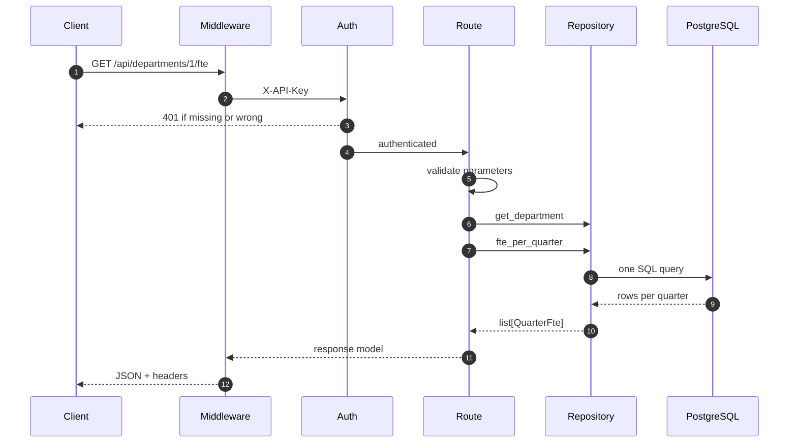

# Architecture

Two processes share one PostgreSQL database: the **importer** ([`pbo-import`](https://github.com/Rain6435/pbo-workforce-data-service/blob/main/src/pbo_workforce/ingest/cli.py#L21), run
on demand) writes it, and the **API** (FastAPI, long-running) reads it. Each
connects with its own database role (see [security.md](security.md)).

## Layers

| Layer | Package | Responsibility | Why it exists |
|---|---|---|---|
| Domain | [`src/pbo_workforce/domain/`](https://github.com/Rain6435/pbo-workforce-data-service/tree/main/src/pbo_workforce/domain) | [`Tenure`](https://github.com/Rain6435/pbo-workforce-data-service/blob/main/src/pbo_workforce/domain/tenure.py#L6-L18), [`parse_tenure`](https://github.com/Rain6435/pbo-workforce-data-service/blob/main/src/pbo_workforce/domain/tenure.py#L43-L56) ([`tenure.py`](https://github.com/Rain6435/pbo-workforce-data-service/blob/main/src/pbo_workforce/domain/tenure.py)); [`YearMonth`](https://github.com/Rain6435/pbo-workforce-data-service/blob/main/src/pbo_workforce/domain/period.py#L23-L38), [`Quarter`](https://github.com/Rain6435/pbo-workforce-data-service/blob/main/src/pbo_workforce/domain/period.py#L41-L50), [`QuarterBasis`](https://github.com/Rain6435/pbo-workforce-data-service/blob/main/src/pbo_workforce/domain/period.py#L12-L20), [`parse_yyyymm`](https://github.com/Rain6435/pbo-workforce-data-service/blob/main/src/pbo_workforce/domain/period.py#L53-L78), [`to_quarter`](https://github.com/Rain6435/pbo-workforce-data-service/blob/main/src/pbo_workforce/domain/period.py#L95-L129), [`year_bounds`](https://github.com/Rain6435/pbo-workforce-data-service/blob/main/src/pbo_workforce/domain/period.py#L132-L137) ([`period.py`](https://github.com/Rain6435/pbo-workforce-data-service/blob/main/src/pbo_workforce/domain/period.py)) | Rules shared by importer and API, testable without a database. The quarter definition lives in one place ([`quarter_offset_months`](https://github.com/Rain6435/pbo-workforce-data-service/blob/main/src/pbo_workforce/domain/period.py#L81-L92)), used by both Python and SQL. |
| Ingest | [`src/pbo_workforce/ingest/`](https://github.com/Rain6435/pbo-workforce-data-service/tree/main/src/pbo_workforce/ingest) | Read, normalize, validate, compare with stored versions, load, report | Keeps every data-quality and versioning decision in pure functions ([`validate.py`](https://github.com/Rain6435/pbo-workforce-data-service/blob/main/src/pbo_workforce/ingest/validate.py), [`versioning.py`](https://github.com/Rain6435/pbo-workforce-data-service/blob/main/src/pbo_workforce/ingest/versioning.py)) separate from I/O ([`reader.py`](https://github.com/Rain6435/pbo-workforce-data-service/blob/main/src/pbo_workforce/ingest/reader.py), [`load.py`](https://github.com/Rain6435/pbo-workforce-data-service/blob/main/src/pbo_workforce/ingest/load.py)). |
| Database | [`src/pbo_workforce/db/`](https://github.com/Rain6435/pbo-workforce-data-service/tree/main/src/pbo_workforce/db) | Typed SQLAlchemy models ([`tables.py`](https://github.com/Rain6435/pbo-workforce-data-service/blob/main/src/pbo_workforce/db/tables.py)), engine and session factories ([`engine.py`](https://github.com/Rain6435/pbo-workforce-data-service/blob/main/src/pbo_workforce/db/engine.py)) | One typed description of the schema. Alembic owns the actual DDL; [`tests/integration/test_migrations.py`](https://github.com/Rain6435/pbo-workforce-data-service/blob/main/tests/integration/test_migrations.py) checks the two agree. |
| Repositories | [`src/pbo_workforce/repositories/`](https://github.com/Rain6435/pbo-workforce-data-service/tree/main/src/pbo_workforce/repositories) | [`list_departments`](https://github.com/Rain6435/pbo-workforce-data-service/blob/main/src/pbo_workforce/repositories/departments.py#L11-L13), [`get_department`](https://github.com/Rain6435/pbo-workforce-data-service/blob/main/src/pbo_workforce/repositories/departments.py#L16-L18), [`fte_per_quarter`](https://github.com/Rain6435/pbo-workforce-data-service/blob/main/src/pbo_workforce/repositories/workforce.py#L35-L105) (reads the [`workforce_current`](data-model.md#workforce_current-view) view) | Keeps SQL out of route handlers so it can be tested directly ([`tests/integration/test_workforce_repo.py`](https://github.com/Rain6435/pbo-workforce-data-service/blob/main/tests/integration/test_workforce_repo.py)). |
| API | [`src/pbo_workforce/api/`](https://github.com/Rain6435/pbo-workforce-data-service/tree/main/src/pbo_workforce/api) | App factory ([`app.py`](https://github.com/Rain6435/pbo-workforce-data-service/blob/main/src/pbo_workforce/api/app.py)), dependencies ([`deps.py`](https://github.com/Rain6435/pbo-workforce-data-service/blob/main/src/pbo_workforce/api/deps.py)), auth and headers ([`security.py`](https://github.com/Rain6435/pbo-workforce-data-service/blob/main/src/pbo_workforce/api/security.py)), errors ([`errors.py`](https://github.com/Rain6435/pbo-workforce-data-service/blob/main/src/pbo_workforce/api/errors.py)), response models ([`schemas.py`](https://github.com/Rain6435/pbo-workforce-data-service/blob/main/src/pbo_workforce/api/schemas.py)), routes | HTTP concerns only: validation, authentication, serialization, error format. |
| Config | [`src/pbo_workforce/config.py`](https://github.com/Rain6435/pbo-workforce-data-service/blob/main/src/pbo_workforce/config.py) | [`Settings`](https://github.com/Rain6435/pbo-workforce-data-service/blob/main/src/pbo_workforce/config.py#L35-L70) (API), [`ImportSettings`](https://github.com/Rain6435/pbo-workforce-data-service/blob/main/src/pbo_workforce/config.py#L73-L77), [`MigrationSettings`](https://github.com/Rain6435/pbo-workforce-data-service/blob/main/src/pbo_workforce/config.py#L80-L87) | Each process reads only its own credentials. |

There is no service layer: the routes call repositories directly, which is enough
for two read-only endpoints.

## Technology choices

The stack was chosen for a small, auditable service that a team can maintain and
that analysts can reach from their own tools. No choice depends on a particular
cloud or vendor.

| Choice | Why | Alternatives considered |
|---|---|---|
| **Python 3.12** | The importer is data work, and Python is the common language between this service and analysts' scripts and notebooks. Modern typing (`type` aliases, `StrEnum`, PEP 695 generics) keeps strict type checking practical. | **C# / .NET:** a strong option in government, but it adds a second language next to analysts' Python. **Node/TypeScript:** weaker for spreadsheet and numeric work. |
| **FastAPI + Pydantic v2** | Request parameters are validated from type annotations, so invalid input is rejected before any query runs. The OpenAPI schema and Swagger UI come from the same models ([`api/schemas.py`](https://github.com/Rain6435/pbo-workforce-data-service/blob/main/src/pbo_workforce/api/schemas.py)), so the docs match the code. Dependency injection keeps sessions, settings and auth testable ([`api/deps.py`](https://github.com/Rain6435/pbo-workforce-data-service/blob/main/src/pbo_workforce/api/deps.py), [`api/security.py`](https://github.com/Rain6435/pbo-workforce-data-service/blob/main/src/pbo_workforce/api/security.py)). | **Flask:** validation and OpenAPI would need extra libraries. **Django REST Framework:** more than two read-only endpoints need, and its ORM is built around app-managed tables. |
| **PostgreSQL 16** | Integrity enforced by the database, not only by code: CHECK constraints, enum types, foreign keys, a partial unique index on the natural key, and a view that exposes current rows only ([`0001_schema.py`](https://github.com/Rain6435/pbo-workforce-data-service/blob/main/migrations/versions/0001_schema.py), [`0003_row_versions.py`](https://github.com/Rain6435/pbo-workforce-data-service/blob/main/migrations/versions/0003_row_versions.py)). Transactional DDL lets migrations and tests roll back cleanly. Roles with per-table grants, read-only sessions and statement timeouts implement least privilege ([`0002_roles.py`](https://github.com/Rain6435/pbo-workforce-data-service/blob/main/migrations/versions/0002_roles.py)). Power BI and Python connect natively. | **SQLite:** no roles or concurrent writers, and different SQL behaviour, so tests would not reflect production. **SQL Server:** equally capable, but heavier to run locally and in CI. |
| **SQLAlchemy 2.0 (typed) + psycopg 3** | Queries are built as expressions with bound parameters, so there is no string-built SQL. The quarterly FTE query is two CTEs written in SQLAlchemy Core ([`repositories/workforce.py`](https://github.com/Rain6435/pbo-workforce-data-service/blob/main/src/pbo_workforce/repositories/workforce.py)). `Mapped[...]` models are checked by pyright. psycopg 3 is the maintained PostgreSQL driver and quotes role DDL safely ([`sql.Literal`](https://github.com/Rain6435/pbo-workforce-data-service/blob/main/migrations/versions/0002_roles.py#L90)). | **Raw SQL strings:** no type checking and easier to get parameterization wrong. **An ORM-only approach:** aggregation is clearer in SQL. |
| **Alembic** | Hand-written, reversible migrations ([`migrations/versions/`](https://github.com/Rain6435/pbo-workforce-data-service/tree/main/migrations/versions)), checked against the models by [`tests/integration/test_migrations.py`](https://github.com/Rain6435/pbo-workforce-data-service/blob/main/tests/integration/test_migrations.py). | **`create_all()`:** no history and no downgrade. |
| **openpyxl, read-only mode** | Streams rows instead of loading the workbook into memory, and exposes raw cell values and types, so the reader decides exactly how each value is interpreted ([`ingest/reader.py`](https://github.com/Rain6435/pbo-workforce-data-service/blob/main/src/pbo_workforce/ingest/reader.py)). Formulas are not evaluated ([`data_only=True`](https://github.com/Rain6435/pbo-workforce-data-service/blob/main/src/pbo_workforce/ingest/reader.py#L44)). | **pandas:** convenient for analysis, but it infers types (dates, floats, NaN), which would hide the data problems the importer must report. It is also a large dependency for row-by-row validation. |
| **uv** | One lockfile ([`uv.lock`](https://github.com/Rain6435/pbo-workforce-data-service/blob/main/uv.lock)) pins every package for reproducible installs locally, in CI, and in the Docker image. | **pip + requirements.txt:** works, but has no lockfile with hashes for every platform by default. |
| **ruff, pyright (strict), pytest** | Lint (including security rules `S`) and formatting in one fast tool; strict static typing with no suppressions; tests against a real PostgreSQL, not mocks. | **mypy:** similar; pyright's strict mode is stricter about unknown types from libraries. |
| **Docker + Compose** | One image serves migrations, import, and API. Evaluators get the whole system with one command. Base images are pinned by digest, and the containers run as non-root with read-only filesystems. | **A single "all-in-one" container:** mixes the database with the app and hides the separation of roles. |

## Import flow

The importer's stages are described in [Import process](import.md#pipeline),
with a [flow diagram](import.md#flow-diagram) at the end of that page.

## Request flow

Example: `GET /api/departments/1/fte?year=2022&tenure=term`.

| Participant | Code | Role |
|---|---|---|
| Middleware | [`SecurityHeadersMiddleware`](https://github.com/Rain6435/pbo-workforce-data-service/blob/main/src/pbo_workforce/api/security.py#L77-L102) | Adds the security headers to every response, errors included. |
| Auth | [`require_api_key`](https://github.com/Rain6435/pbo-workforce-data-service/blob/main/src/pbo_workforce/api/security.py#L37-L53) | Compares the SHA-256 of `X-API-Key` with the configured digests in constant time; a missing or wrong key gets a 401 (step 3) before any parameter is validated. |
| Route | [`routes/departments.py`](https://github.com/Rain6435/pbo-workforce-data-service/blob/main/src/pbo_workforce/api/routes/departments.py) | Validates `dept_id`, `year`, and `tenure` (422 on error, step 5); returns 404 if the department does not exist (step 6); rounds values and omits unselected tenures (step 11). |
| Repository | [`fte_per_quarter`](https://github.com/Rain6435/pbo-workforce-data-service/blob/main/src/pbo_workforce/repositories/workforce.py#L35-L105), [`get_department`](https://github.com/Rain6435/pbo-workforce-data-service/blob/main/src/pbo_workforce/repositories/departments.py#L16-L18) | Builds one parameterized query with two CTEs (step 8), applying the quarter basis and filters. |
| PostgreSQL | [`workforce_current`](data-model.md#workforce_current-view) | Connected as `pbo_api`: read-only sessions, current versions only ([D16](assumptions.md#d16)). |

Errors from any step use one body, `{"error": {"code", "message"}}`, produced by
[`api/errors.py`](https://github.com/Rain6435/pbo-workforce-data-service/blob/main/src/pbo_workforce/api/errors.py) ([`_handle`](https://github.com/Rain6435/pbo-workforce-data-service/blob/main/src/pbo_workforce/api/errors.py#L47-L76)). Sessions come from [`api/deps.py`](https://github.com/Rain6435/pbo-workforce-data-service/blob/main/src/pbo_workforce/api/deps.py) ([`get_session`](https://github.com/Rain6435/pbo-workforce-data-service/blob/main/src/pbo_workforce/api/deps.py#L39-L46)) and
are closed after each request.
