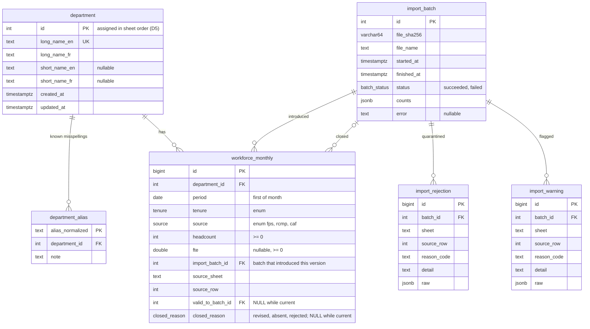

# Data model

Defined in [`migrations/versions/0001_schema.py`](https://github.com/Rain6435/pbo-workforce-data-service/blob/main/migrations/versions/0001_schema.py),
extended by [`0003_row_versions.py`](https://github.com/Rain6435/pbo-workforce-data-service/blob/main/migrations/versions/0003_row_versions.py), and mirrored by typed models in
[`src/pbo_workforce/db/tables.py`](https://github.com/Rain6435/pbo-workforce-data-service/blob/main/src/pbo_workforce/db/tables.py).
[`tests/integration/test_migrations.py`](https://github.com/Rain6435/pbo-workforce-data-service/blob/main/tests/integration/test_migrations.py) checks that the two agree
([`test_models_match_migrations`](https://github.com/Rain6435/pbo-workforce-data-service/blob/main/tests/integration/test_migrations.py), [`test_check_constraint_names_match_models`](https://github.com/Rain6435/pbo-workforce-data-service/blob/main/tests/integration/test_migrations.py)) and
that the migrations can be reversed ([`test_downgrade_to_base_and_upgrade_again`](https://github.com/Rain6435/pbo-workforce-data-service/blob/main/tests/integration/test_migrations.py)).

## Tables

### `department`

One row per department, kept even if a later sheet no longer lists it
([D20](assumptions.md#d20)). `id` is not a sequence: the importer assigns it
([`_upsert_departments`](https://github.com/Rain6435/pbo-workforce-data-service/blob/main/src/pbo_workforce/ingest/load.py), [D5](assumptions.md#d5)). `long_name_en` is unique. Names are stored as in the
source with outer whitespace removed (`’` preserved, [D6](assumptions.md#d6)). Short names are NULL
when the source has none ([D21](assumptions.md#d21)).

### `department_alias`

Reviewed misspellings from [`src/pbo_workforce/ingest/aliases.py`](https://github.com/Rain6435/pbo-workforce-data-service/blob/main/src/pbo_workforce/ingest/aliases.py), replaced on
every import ([`_replace_aliases`](https://github.com/Rain6435/pbo-workforce-data-service/blob/main/src/pbo_workforce/ingest/load.py)) so the table always matches the code that was
used. The primary key is the normalized alias.

### `workforce_monthly`

One version of an accepted source row ([D1](assumptions.md#d1), [D16](assumptions.md#d16)). A version is
*current* while `valid_to_batch_id` is NULL. Imports never delete or update
values: they close a version (set `valid_to_batch_id` and `closed_reason`) and
insert a new one, so the table also holds the history of every revision.

- Partial unique index [`uq_workforce_monthly_current_key`](https://github.com/Rain6435/pbo-workforce-data-service/blob/main/migrations/versions/0003_row_versions.py) on
  `(department_id, period, tenure, source)` `WHERE valid_to_batch_id IS NULL`:
  at most one current version per natural key, while history may hold several.
  Duplicates are quarantined before insert ([D10](assumptions.md#d10)), so this index is a safety net.
- Partial index [`ix_workforce_monthly_current_department_id_source_period`](https://github.com/Rain6435/pbo-workforce-data-service/blob/main/migrations/versions/0003_row_versions.py)
  `WHERE valid_to_batch_id IS NULL`: serves [`fte_per_quarter`](https://github.com/Rain6435/pbo-workforce-data-service/blob/main/src/pbo_workforce/repositories/workforce.py), which reads
  one department and source over a period range ([D12](assumptions.md#d12) [`year_bounds`](https://github.com/Rain6435/pbo-workforce-data-service/blob/main/src/pbo_workforce/domain/period.py)), and
  stays the size of the current data as history grows.
- CHECK constraints:
  - [`headcount_non_negative`](https://github.com/Rain6435/pbo-workforce-data-service/blob/main/migrations/versions/0001_schema.py), [`fte_non_negative`](https://github.com/Rain6435/pbo-workforce-data-service/blob/main/migrations/versions/0001_schema.py): repeat [D8](assumptions.md#d8) in the database.
  - [`period_first_of_month`](https://github.com/Rain6435/pbo-workforce-data-service/blob/main/migrations/versions/0001_schema.py): one representation per month.
  - [`source_shape`](https://github.com/Rain6435/pbo-workforce-data-service/blob/main/migrations/versions/0001_schema.py): FPS rows have FTE and a real tenure; RCMP/CAF rows have no
    FTE and tenure `combined` ([D11](assumptions.md#d11)).
  - [`closed_consistent`](https://github.com/Rain6435/pbo-workforce-data-service/blob/main/migrations/versions/0003_row_versions.py): `valid_to_batch_id` and `closed_reason` are both set
    or both NULL.
- **Provenance:** `import_batch_id`, `source_sheet`, and `source_row` identify the
  file and Excel row every figure came from.

Enums are PostgreSQL types (`tenure`, `source`, `closed_reason`), so invalid
values cannot be stored.

### `workforce_current` (view)

`SELECT … FROM workforce_monthly WHERE valid_to_batch_id IS NULL`: the current
version of every row, without the version columns. The API reads this view,
never the table, and the API role is only granted the view, so the API cannot
serve history by mistake ([D16](assumptions.md#d16)).

How it is defined in the code:

- **Created by the migration.** [`0003_row_versions.py`](https://github.com/Rain6435/pbo-workforce-data-service/blob/main/migrations/versions/0003_row_versions.py)
  runs `CREATE VIEW` and moves the API role's `SELECT` grant from the table to
  the view; its `downgrade()` reverses both. The view's definition lives with
  the rest of the schema history.
- **Described, not created, in Python.** [`workforce_current`](https://github.com/Rain6435/pbo-workforce-data-service/blob/main/src/pbo_workforce/db/tables.py)
  in `src/pbo_workforce/db/tables.py` is a SQLAlchemy `Table` listing the
  columns the queries need, so [`fte_per_quarter`](https://github.com/Rain6435/pbo-workforce-data-service/blob/main/src/pbo_workforce/repositories/workforce.py)
  can query it with typed expressions. It has its own `MetaData()`, separate
  from the models, so Alembic's model-to-database comparison and `create_all()`
  never treat it as a table to manage or create.
- **Drift is caught by tests.** The repository and API tests
  ([`test_workforce_repo.py`](https://github.com/Rain6435/pbo-workforce-data-service/blob/main/tests/integration/test_workforce_repo.py),
  [`test_fte.py`](https://github.com/Rain6435/pbo-workforce-data-service/blob/main/tests/api/test_fte.py)) query through the view, so a
  mismatch between the Python description and the real view fails them.

### `import_batch`

One row per import attempt ([D14](assumptions.md#d14), [D19](assumptions.md#d19)). `file_sha256` drives idempotency: a
file is skipped only if it matches the latest successful batch. [`counts`](https://github.com/Rain6435/pbo-workforce-data-service/blob/main/src/pbo_workforce/ingest/report.py) holds
per-sheet read/accepted/collapsed counts, rejections and warnings by code, and
version counts (unchanged, added, revised, closed), as in the report. `error` is
set only for failed batches. Workforce rows reference a batch twice: the batch
that introduced a version and, once closed, the batch that closed it.

### `import_rejection`, `import_warning`

Every quarantined row ([D8](assumptions.md#d8), [D10](assumptions.md#d10)) and every warning ([D9](assumptions.md#d9), [D10](assumptions.md#d10)), with the raw cell
values as JSONB, so an analyst can see exactly what the source contained. Both
are indexed on `batch_id`. These tables are not readable by the API role.

## Why monthly grain and provenance columns

- Quarters are derived ([D1](assumptions.md#d1)), so a change of quarter basis ([D2](assumptions.md#d2)) or averaging rule
  ([D3](assumptions.md#d3)) is a query change, not a data migration.
- Headcount and FTE are kept side by side at the grain they are reported, so
  other measures (for example headcount per quarter) need no re-import.
- Provenance answers "where does this number come from?" down to the Excel row,
  and makes each import auditable: rows point at their batch, and the batch
  records the file's hash.
- Versions answer "what did this figure say before, and which import changed
  it?", so analyses published from earlier data stay reproducible ([D16](assumptions.md#d16)).

## Roles

[`migrations/versions/0002_roles.py`](https://github.com/Rain6435/pbo-workforce-data-service/blob/main/migrations/versions/0002_roles.py)
creates [`pbo_api`](https://github.com/Rain6435/pbo-workforce-data-service/blob/main/migrations/versions/0002_roles.py) (read-only sessions, 5 s statement timeout) and [`pbo_import`](https://github.com/Rain6435/pbo-workforce-data-service/blob/main/migrations/versions/0002_roles.py)
(SELECT/INSERT/UPDATE/DELETE on the six application tables, no DDL).
[`0003_row_versions.py`](https://github.com/Rain6435/pbo-workforce-data-service/blob/main/migrations/versions/0003_row_versions.py) limits
[`pbo_api`](https://github.com/Rain6435/pbo-workforce-data-service/blob/main/migrations/versions/0002_roles.py) to SELECT on `department` and the [`workforce_current`](https://github.com/Rain6435/pbo-workforce-data-service/blob/main/migrations/versions/0003_row_versions.py) view; it cannot
read `workforce_monthly` itself or any import table. See [security.md](security.md).
