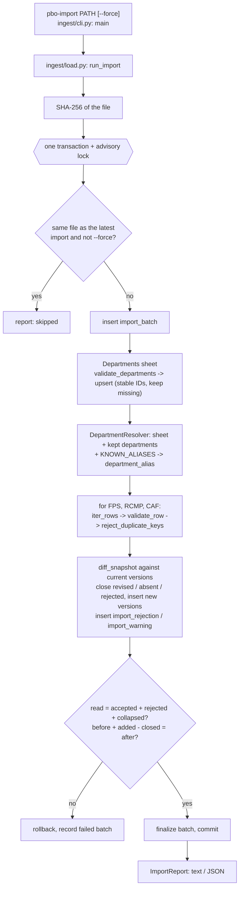

# Import process

```sh
pbo-import PATH [--force] [--report-json REPORT.json]
```

Entry point: [`main`](https://github.com/Rain6435/pbo-workforce-data-service/blob/main/src/pbo_workforce/ingest/cli.py#L14-L56) in [`src/pbo_workforce/ingest/cli.py`](https://github.com/Rain6435/pbo-workforce-data-service/blob/main/src/pbo_workforce/ingest/cli.py).
It connects as [`pbo_import`](https://github.com/Rain6435/pbo-workforce-data-service/blob/main/migrations/versions/0002_roles.py#L34) ([`IMPORT_DATABASE_URL`](https://github.com/Rain6435/pbo-workforce-data-service/blob/main/src/pbo_workforce/config.py#L77)) and prints the report. Exit
codes: `0` imported, or skipped because the file matches the latest import; `1` failed and nothing was
changed; `2` invalid arguments.

## Pipeline

| Stage | Code | What happens |
|---|---|---|
| Hash | [`load.py`](https://github.com/Rain6435/pbo-workforce-data-service/blob/main/src/pbo_workforce/ingest/load.py) → [`_sha256`](https://github.com/Rain6435/pbo-workforce-data-service/blob/main/src/pbo_workforce/ingest/load.py#L125-L133) | SHA-256 of the file; a missing or unreadable file fails before touching the database. |
| Lock and skip | [`load.py`](https://github.com/Rain6435/pbo-workforce-data-service/blob/main/src/pbo_workforce/ingest/load.py) → [`_import`](https://github.com/Rain6435/pbo-workforce-data-service/blob/main/src/pbo_workforce/ingest/load.py#L136-L182) | [`pg_advisory_xact_lock`](https://github.com/Rain6435/pbo-workforce-data-service/blob/main/src/pbo_workforce/ingest/load.py#L139) serializes imports. If the latest `succeeded` batch has the same hash and [`--force`](https://github.com/Rain6435/pbo-workforce-data-service/blob/main/src/pbo_workforce/ingest/cli.py#L26) is not given, the report says `skipped` and nothing is written ([D14](assumptions.md#d14)). |
| Open | [`reader.py`](https://github.com/Rain6435/pbo-workforce-data-service/blob/main/src/pbo_workforce/ingest/reader.py) → [`open_workbook`](https://github.com/Rain6435/pbo-workforce-data-service/blob/main/src/pbo_workforce/ingest/reader.py#L36-L50) | openpyxl [`read_only=True, data_only=True`](https://github.com/Rain6435/pbo-workforce-data-service/blob/main/src/pbo_workforce/ingest/reader.py#L44) (rows are streamed; formulas are not evaluated, cached values are read). A file that is not a valid .xlsx fails with [`SourceFileError`](https://github.com/Rain6435/pbo-workforce-data-service/blob/main/src/pbo_workforce/ingest/reader.py#L22-L23). |
| Read | [`reader.py`](https://github.com/Rain6435/pbo-workforce-data-service/blob/main/src/pbo_workforce/ingest/reader.py) → [`iter_rows`](https://github.com/Rain6435/pbo-workforce-data-service/blob/main/src/pbo_workforce/ingest/reader.py#L53-L81) | Only declared sheets and columns are read. The header must equal the [`SheetSpec`](https://github.com/Rain6435/pbo-workforce-data-service/blob/main/src/pbo_workforce/ingest/sources.py#L37-L46) header exactly (schema drift fails the import). Cells are narrowed to [`str \| int \| float \| None`](https://github.com/Rain6435/pbo-workforce-data-service/blob/main/src/pbo_workforce/ingest/reader.py#L17); fully blank rows are skipped. |
| Departments | [`validate.py`](https://github.com/Rain6435/pbo-workforce-data-service/blob/main/src/pbo_workforce/ingest/validate.py) → [`validate_departments`](https://github.com/Rain6435/pbo-workforce-data-service/blob/main/src/pbo_workforce/ingest/validate.py#L260-L293); [`load.py`](https://github.com/Rain6435/pbo-workforce-data-service/blob/main/src/pbo_workforce/ingest/load.py) → [`_upsert_departments`](https://github.com/Rain6435/pbo-workforce-data-service/blob/main/src/pbo_workforce/ingest/load.py#L202-L237) | Names canonicalized, identical duplicates collapsed, conflicting duplicates fail. Upsert with stable IDs ([D5](assumptions.md#d5)); departments missing from the sheet are kept ([D20](assumptions.md#d20)). |
| Aliases | [`normalize.py`](https://github.com/Rain6435/pbo-workforce-data-service/blob/main/src/pbo_workforce/ingest/normalize.py) → [`DepartmentResolver`](https://github.com/Rain6435/pbo-workforce-data-service/blob/main/src/pbo_workforce/ingest/normalize.py#L40-L72); [`load.py`](https://github.com/Rain6435/pbo-workforce-data-service/blob/main/src/pbo_workforce/ingest/load.py) → [`_replace_aliases`](https://github.com/Rain6435/pbo-workforce-data-service/blob/main/src/pbo_workforce/ingest/load.py#L249-L262) | Resolver built from the departments in this sheet, the departments kept from earlier imports ([D20](assumptions.md#d20)), and [`KNOWN_ALIASES`](https://github.com/Rain6435/pbo-workforce-data-service/blob/main/src/pbo_workforce/ingest/aliases.py#L13-L17). An alias whose target is not a known department, or that is itself a department's name, fails the import ([`AliasConfigError`](https://github.com/Rain6435/pbo-workforce-data-service/blob/main/src/pbo_workforce/ingest/normalize.py#L18-L19)); an alias whose target was dropped from the sheet still resolves to the kept department. |
| Validate rows | [`validate.py`](https://github.com/Rain6435/pbo-workforce-data-service/blob/main/src/pbo_workforce/ingest/validate.py) → [`validate_row`](https://github.com/Rain6435/pbo-workforce-data-service/blob/main/src/pbo_workforce/ingest/validate.py#L106-L168) | Each workforce row is accepted (with warnings) or rejected with one reason code ([D8](assumptions.md#d8), [D18](assumptions.md#d18)). |
| Duplicates | [`validate.py`](https://github.com/Rain6435/pbo-workforce-data-service/blob/main/src/pbo_workforce/ingest/validate.py) → [`reject_duplicate_keys`](https://github.com/Rain6435/pbo-workforce-data-service/blob/main/src/pbo_workforce/ingest/validate.py#L218-L247) | All rows sharing a key are rejected ([D10](assumptions.md#d10)). |
| Compare | [`versioning.py`](https://github.com/Rain6435/pbo-workforce-data-service/blob/main/src/pbo_workforce/ingest/versioning.py) → [`diff_snapshot`](https://github.com/Rain6435/pbo-workforce-data-service/blob/main/src/pbo_workforce/ingest/versioning.py#L41-L67) | Each accepted row is compared with the stored current version for the same key: unchanged, added, or revised. Current versions with no accepted row in the file are closed as `absent`, or [`rejected`](https://github.com/Rain6435/pbo-workforce-data-service/blob/main/src/pbo_workforce/ingest/report.py#L96-L99) if their row was quarantined ([D16](assumptions.md#d16)). |
| Load | [`load.py`](https://github.com/Rain6435/pbo-workforce-data-service/blob/main/src/pbo_workforce/ingest/load.py) → [`_load_sheet`](https://github.com/Rain6435/pbo-workforce-data-service/blob/main/src/pbo_workforce/ingest/load.py#L265-L333) | Revised and vanished versions are closed (never deleted), new versions are inserted in chunks of 5,000, and rejections and warnings are inserted. |
| Reconcile | [`report.py`](https://github.com/Rain6435/pbo-workforce-data-service/blob/main/src/pbo_workforce/ingest/report.py) → [`SheetReport.reconciles`](https://github.com/Rain6435/pbo-workforce-data-service/blob/main/src/pbo_workforce/ingest/report.py#L106-L110) | Proves no row was lost or created silently ([details](#reconciliation)). Per sheet: read = accepted + rejected + collapsed, and current rows before + added − closed = current rows after. A mismatch raises [`ReconciliationError`](https://github.com/Rain6435/pbo-workforce-data-service/blob/main/src/pbo_workforce/ingest/load.py#L89-L90) and rolls back. |
| Finalize | [`load.py`](https://github.com/Rain6435/pbo-workforce-data-service/blob/main/src/pbo_workforce/ingest/load.py) → [`_import`](https://github.com/Rain6435/pbo-workforce-data-service/blob/main/src/pbo_workforce/ingest/load.py#L136-L182) | Batch [`counts`](https://github.com/Rain6435/pbo-workforce-data-service/blob/main/src/pbo_workforce/ingest/report.py#L120-L129) and `finished_at` set; commit. |

Sheets are declared in [`src/pbo_workforce/ingest/sources.py`](https://github.com/Rain6435/pbo-workforce-data-service/blob/main/src/pbo_workforce/ingest/sources.py):

| Sheet | Source | Required measures | Allowed tenures | Cadence rule |
|---|---|---|---|---|
| Federal Public Service | `fps` | headcount, fte | the five FTE tenures | none |
| RCMP | `rcmp` | headcount | `Combined` | annual, March, until 2025-03 |
| CAF | `caf` | headcount | `Combined` | annual, March, until 2025-03 |
| Departments | (reference) | `long_name_en`, `long_name_fr` | n/a | n/a |

## Rejection codes

Checked in this order; the first failure is recorded ([`RejectReason`](https://github.com/Rain6435/pbo-workforce-data-service/blob/main/src/pbo_workforce/ingest/validate.py#L25-L37) in
[`src/pbo_workforce/ingest/validate.py`](https://github.com/Rain6435/pbo-workforce-data-service/blob/main/src/pbo_workforce/ingest/validate.py)). The whole row is quarantined in
[`import_rejection`](data-model.md#import_rejection-import_warning) with its raw values.

| Code | Rule | Test ([`tests/unit/test_validate.py`](https://github.com/Rain6435/pbo-workforce-data-service/blob/main/tests/unit/test_validate.py)) |
|---|---|---|
| [`INVALID_DATE`](https://github.com/Rain6435/pbo-workforce-data-service/blob/main/src/pbo_workforce/ingest/validate.py#L28) | `date` is not exactly six digits `YYYYMM` with month 1 to 12 (int, integral float, or text; bools rejected) | [`test_invalid_date`](https://github.com/Rain6435/pbo-workforce-data-service/blob/main/tests/unit/test_validate.py#L88-L90) |
| [`UNKNOWN_DEPARTMENT`](https://github.com/Rain6435/pbo-workforce-data-service/blob/main/src/pbo_workforce/ingest/validate.py#L29) | name does not match a department (in the sheet or kept from earlier imports) after normalization or through [`KNOWN_ALIASES`](https://github.com/Rain6435/pbo-workforce-data-service/blob/main/src/pbo_workforce/ingest/aliases.py#L13-L17) | [`test_unknown_department`](https://github.com/Rain6435/pbo-workforce-data-service/blob/main/tests/unit/test_validate.py#L93-L95) |
| [`BLANK_TENURE`](https://github.com/Rain6435/pbo-workforce-data-service/blob/main/src/pbo_workforce/ingest/validate.py#L30) | tenure cell empty or whitespace | [`test_blank_tenure`](https://github.com/Rain6435/pbo-workforce-data-service/blob/main/tests/unit/test_validate.py#L98-L100) |
| [`UNKNOWN_TENURE`](https://github.com/Rain6435/pbo-workforce-data-service/blob/main/src/pbo_workforce/ingest/validate.py#L31) | tenure not recognized, or not allowed for the sheet (`Combined` in FPS, `Term` in CAF) | [`test_unknown_tenure`](https://github.com/Rain6435/pbo-workforce-data-service/blob/main/tests/unit/test_validate.py#L103-L105), [`test_fps_tenure_not_allowed_in_caf`](https://github.com/Rain6435/pbo-workforce-data-service/blob/main/tests/unit/test_validate.py#L108-L109) |
| [`NULL_MEASURE`](https://github.com/Rain6435/pbo-workforce-data-service/blob/main/src/pbo_workforce/ingest/validate.py#L32) | a required measure is empty | [`test_null_measure`](https://github.com/Rain6435/pbo-workforce-data-service/blob/main/tests/unit/test_validate.py#L112-L114), [`test_null_headcount_in_caf`](https://github.com/Rain6435/pbo-workforce-data-service/blob/main/tests/unit/test_validate.py#L117-L118) |
| [`INVALID_MEASURE`](https://github.com/Rain6435/pbo-workforce-data-service/blob/main/src/pbo_workforce/ingest/validate.py#L34) | a measure is text, NaN or infinite, or headcount is fractional | [`test_invalid_measure`](https://github.com/Rain6435/pbo-workforce-data-service/blob/main/tests/unit/test_validate.py#L121-L132) |
| [`NEGATIVE_MEASURE`](https://github.com/Rain6435/pbo-workforce-data-service/blob/main/src/pbo_workforce/ingest/validate.py#L35) | a measure is below 0 | [`test_negative_measure`](https://github.com/Rain6435/pbo-workforce-data-service/blob/main/tests/unit/test_validate.py#L139-L141) |
| [`DUPLICATE_KEY`](https://github.com/Rain6435/pbo-workforce-data-service/blob/main/src/pbo_workforce/ingest/validate.py#L37) | another row has the same department, month, tenure, and source | [`test_duplicate_keys_reject_every_copy`](https://github.com/Rain6435/pbo-workforce-data-service/blob/main/tests/unit/test_validate.py#L191-L202) |

## Warning codes

The row is accepted unchanged and recorded in [`import_warning`](data-model.md#import_rejection-import_warning) ([`WarningCode`](https://github.com/Rain6435/pbo-workforce-data-service/blob/main/src/pbo_workforce/ingest/validate.py#L40-L45)).

| Code | Rule | Test |
|---|---|---|
| [`FTE_EXCEEDS_HEADCOUNT`](https://github.com/Rain6435/pbo-workforce-data-service/blob/main/src/pbo_workforce/ingest/validate.py#L43) | `fte > headcount` | [`test_fte_exceeds_headcount_is_accepted_with_warning`](https://github.com/Rain6435/pbo-workforce-data-service/blob/main/tests/unit/test_validate.py#L155-L158) |
| [`SUSPECT_DATE`](https://github.com/Rain6435/pbo-workforce-data-service/blob/main/src/pbo_workforce/ingest/validate.py#L44) | RCMP/CAF row before 2025-03 in a month other than March | [`test_off_cadence_date_is_suspect`](https://github.com/Rain6435/pbo-workforce-data-service/blob/main/tests/unit/test_validate.py#L165-L179) |
| [`DUPLICATE_DEPARTMENT_ROW`](https://github.com/Rain6435/pbo-workforce-data-service/blob/main/src/pbo_workforce/ingest/validate.py#L45) | Departments row identical to an earlier one; collapsed | [`test_identical_duplicate_department_is_collapsed_with_warning`](https://github.com/Rain6435/pbo-workforce-data-service/blob/main/tests/unit/test_validate.py#L248-L254) |

Failures of the whole file ([`SourceFileError`](https://github.com/Rain6435/pbo-workforce-data-service/blob/main/src/pbo_workforce/ingest/reader.py#L22-L23), [`AliasConfigError`](https://github.com/Rain6435/pbo-workforce-data-service/blob/main/src/pbo_workforce/ingest/normalize.py#L18-L19),
[`ReconciliationError`](https://github.com/Rain6435/pbo-workforce-data-service/blob/main/src/pbo_workforce/ingest/load.py#L89-L90)): not an .xlsx file, missing sheet, unexpected header, blank
department long name, conflicting duplicate department, or an alias that points
to no known department or is itself a department's name.

## Reconciliation

Reconciliation proves that the import neither lost nor invented a row along the
way. After every sheet is loaded, and before the transaction commits, two
equations are checked for each sheet
([`SheetReport.reconciles`](https://github.com/Rain6435/pbo-workforce-data-service/blob/main/src/pbo_workforce/ingest/report.py#L106-L110)).

**1. Every row read is accounted for exactly once.**

```text
read = accepted + rejected + collapsed
```

- `read`: data rows read from the sheet (the header is not counted).
- `accepted`: rows that passed validation, with or without warnings.
- `rejected`: rows quarantined in [`import_rejection`](data-model.md#import_rejection-import_warning), each with a reason code,
  its Excel row number, and the raw values.
- `collapsed`: identical duplicate rows of the Departments sheet, folded into one
  ([D10](assumptions.md#d10)). Always 0 for the workforce sheets, where duplicates are rejected.

If a code path ever dropped a row without accepting or rejecting it, or counted
a row twice (for example a duplicate both accepted and rejected), the two sides
would differ.

**2. Every change to the current figures is explained** (workforce sheets only).

```text
current before + added − closed = current after
```

- `current before`: current rows for that source before the import.
- `added`: keys that are new in this file.
- `closed`: current rows closed because their key is no longer in the file, or
  because its row is now quarantined ([D16](assumptions.md#d16)).
- `current after`: current rows for that source, counted again in the database
  after the writes
  ([`_count_current`](https://github.com/Rain6435/pbo-workforce-data-service/blob/main/src/pbo_workforce/ingest/load.py#L402-L409)).

Revised figures do not appear in the equation: each one closes the old version
and adds the new one, so the number of current rows does not change. Because
`current after` is counted in the database rather than computed, this equation
checks what was actually written against what the comparison planned.

**If either equation fails,** the import raises
[`ReconciliationError`](https://github.com/Rain6435/pbo-workforce-data-service/blob/main/src/pbo_workforce/ingest/load.py#L89-L90) naming the sheets that do not add up
([`_import`](https://github.com/Rain6435/pbo-workforce-data-service/blob/main/src/pbo_workforce/ingest/load.py#L136-L182)). The transaction rolls back, so no figure is changed;
a `failed` batch is recorded with that message ([D19](assumptions.md#d19)); and
[`pbo-import`](https://github.com/Rain6435/pbo-workforce-data-service/blob/main/src/pbo_workforce/ingest/cli.py#L21) exits with code 1.

**Where it shows:** the last two lines of every import report (see the
[report for `data/data.xlsx`](#report-for-datadataxlsx)), and the per-sheet counts stored in
[`import_batch.counts`](data-model.md#import_batch). In CI, the Compose job fails if the first line is
not `OK` ([`.github/workflows/ci.yml`](https://github.com/Rain6435/pbo-workforce-data-service/blob/main/.github/workflows/ci.yml#L84-L87)). Tests:
[`test_sheet_counts_and_reconciliation`](https://github.com/Rain6435/pbo-workforce-data-service/blob/main/tests/integration/test_import_real_file.py#L80-L93) checks the counts for the real file, and
[`test_report_renders_text_and_json`](https://github.com/Rain6435/pbo-workforce-data-service/blob/main/tests/integration/test_import.py#L512-L543) checks how the result is reported.

## Idempotency and transactions

- **Same file as the latest import:** skipped, reporting that batch's ID
  ([`test_second_import_of_same_file_is_a_noop`](https://github.com/Rain6435/pbo-workforce-data-service/blob/main/tests/integration/test_import.py#L194-L201)).
- **[`--force`](https://github.com/Rain6435/pbo-workforce-data-service/blob/main/src/pbo_workforce/ingest/cli.py#L26):** imports again as a new batch; every row is unchanged, so no
  version is added or closed ([`test_forced_reimport_of_same_file_changes_nothing`](https://github.com/Rain6435/pbo-workforce-data-service/blob/main/tests/integration/test_import.py#L204-L225)).
- **A newer file:** current data becomes that file's content; revised, absent,
  and now-quarantined rows are closed and kept as history, and the report lists
  each one with its old and new values ([D16](assumptions.md#d16),
  [`test_revised_value_closes_old_version_and_adds_new_one`](https://github.com/Rain6435/pbo-workforce-data-service/blob/main/tests/integration/test_import.py#L283-L297),
  [`test_row_absent_from_new_file_is_closed_not_deleted`](https://github.com/Rain6435/pbo-workforce-data-service/blob/main/tests/integration/test_import.py#L253-L280)).
- **An older file again:** applied, not skipped, because it changes the data
  back ([`test_older_file_imported_again_is_applied_not_skipped`](https://github.com/Rain6435/pbo-workforce-data-service/blob/main/tests/integration/test_import.py#L326-L345)).
- **All or nothing:** a failure at any point, even after rows were inserted,
  leaves the database unchanged
  ([`test_failure_after_rows_were_written_rolls_back_everything`](https://github.com/Rain6435/pbo-workforce-data-service/blob/main/tests/integration/test_import.py#L435-L448)). A `failed`
  batch is then recorded in its own transaction ([D19](assumptions.md#d19)); it does not block a retry
  ([`test_failed_import_does_not_block_retry`](https://github.com/Rain6435/pbo-workforce-data-service/blob/main/tests/integration/test_import.py#L451-L457)).
- **Concurrency:** two imports cannot interleave (advisory lock).

## Report for `data/data.xlsx`

Output of [`pbo-import data/data.xlsx`](https://github.com/Rain6435/pbo-workforce-data-service/blob/main/src/pbo_workforce/ingest/cli.py) (about 20 s). The batch number depends on
the database; the 31 middle [`FTE_EXCEEDS_HEADCOUNT`](https://github.com/Rain6435/pbo-workforce-data-service/blob/main/src/pbo_workforce/ingest/validate.py#L43) lines are elided here and
printed in full by the command.

```
Imported data.xlsx as batch 1 (sha256 476aede446a8...)

[Departments]
  read 102, accepted 101, rejected 0, collapsed 1 (ok)
  warning  DUPLICATE_DEPARTMENT_ROW: 1
    row 14: DUPLICATE_DEPARTMENT_ROW - identical to row 13; collapsed

[Federal Public Service]
  read 44408, accepted 44391, rejected 17 (ok)
  rejected BLANK_TENURE: 1
  rejected NEGATIVE_MEASURE: 1
  rejected NULL_MEASURE: 15
  warning  FTE_EXCEEDS_HEADCOUNT: 33
    row 490: NULL_MEASURE - headcount is null
    row 497: NULL_MEASURE - fte is null
    row 502: NEGATIVE_MEASURE - headcount -20 < 0
    row 633: NULL_MEASURE - headcount is null
    row 639: NULL_MEASURE - headcount is null
    row 887: NULL_MEASURE - headcount is null
    row 891: NULL_MEASURE - fte is null
    row 1225: NULL_MEASURE - headcount is null
    row 1226: NULL_MEASURE - fte is null
    row 1227: NULL_MEASURE - fte is null
    row 1228: NULL_MEASURE - fte is null
    row 1519: NULL_MEASURE - headcount is null
    row 1520: NULL_MEASURE - headcount is null
    row 1521: NULL_MEASURE - fte is null
    row 2672: NULL_MEASURE - headcount is null
    row 2678: NULL_MEASURE - headcount is null
    row 3845: BLANK_TENURE - tenure is blank
    row 5337: FTE_EXCEEDS_HEADCOUNT - fte 10.0671 > headcount 10
    row 5370: FTE_EXCEEDS_HEADCOUNT - fte 398.644 > headcount 393
    ...
    row 44322: FTE_EXCEEDS_HEADCOUNT - fte 2.06897 > headcount 2
  versions: unchanged 0, added 44391, revised 0, closed 0 (current rows 0 -> 44391)

[RCMP]
  read 26, accepted 26, rejected 0 (ok)
  warning  SUSPECT_DATE: 1
    row 2: SUSPECT_DATE - 201504 is off the annual cadence (month 3 before 202503)
  versions: unchanged 0, added 26, revised 0, closed 0 (current rows 0 -> 26)

[CAF]
  read 26, accepted 26, rejected 0 (ok)
  warning  SUSPECT_DATE: 1
    row 2: SUSPECT_DATE - 201504 is off the annual cadence (month 3 before 202503)
  versions: unchanged 0, added 26, revised 0, closed 0 (current rows 0 -> 26)

Reconciliation (read = accepted + rejected + collapsed): OK
Versions (current before + added - closed = current after): OK
```

This is a first import, so every row is `added`. Importing the same file again
with [`--force`](https://github.com/Rain6435/pbo-workforce-data-service/blob/main/src/pbo_workforce/ingest/cli.py#L26) reports `unchanged 44391, added 0, revised 0, closed 0`. When a
later file changes data, each revised or closed row is listed under the
[`versions`](https://github.com/Rain6435/pbo-workforce-data-service/blob/main/tests/integration/test_import.py#L232-L247) line, for example:

```
  versions: unchanged 44389, added 0, revised 1, closed 1 (current rows 44391 -> 44390)
    Accessibility Standards Canada, 2021-12, term: revised headcount 9, fte 7.33 -> headcount 9, fte 7.5 (row 26153)
    Passport Canada, 2016-07, indeterminate: closed (absent), was headcount 1, fte 1
```

The text report lists up to 50 changes per sheet; [`--report-json`](https://github.com/Rain6435/pbo-workforce-data-service/blob/main/src/pbo_workforce/ingest/cli.py#L31) always lists
all of them, with old and new values.

How the ten known data problems appear here, and the tests that pin them down,
are in [`tests/integration/test_import_real_file.py`](https://github.com/Rain6435/pbo-workforce-data-service/blob/main/tests/integration/test_import_real_file.py) ([`test_problem_1_*`](https://github.com/Rain6435/pbo-workforce-data-service/blob/main/tests/integration/test_import_real_file.py#L111-L126) to
[`test_problem_10_*`](https://github.com/Rain6435/pbo-workforce-data-service/blob/main/tests/integration/test_import_real_file.py#L236-L246)); findings are discussed in
[assumptions.md](assumptions.md#findings-from-profiling-datadataxlsx).
[`--report-json`](https://github.com/Rain6435/pbo-workforce-data-service/blob/main/src/pbo_workforce/ingest/cli.py#L31) writes the same report with every rejection and warning,
including raw values, as JSON ([`ImportReport.to_json`](https://github.com/Rain6435/pbo-workforce-data-service/blob/main/src/pbo_workforce/ingest/report.py#L147-L198)).

## Adding a new source sheet

1. Add a [`Source`](https://github.com/Rain6435/pbo-workforce-data-service/blob/main/src/pbo_workforce/db/tables.py#L36-L41) value in [`src/pbo_workforce/db/tables.py`](https://github.com/Rain6435/pbo-workforce-data-service/blob/main/src/pbo_workforce/db/tables.py) and a migration that
   adds it to the `source` enum (`ALTER TYPE source ADD VALUE ...`), adjusting
   [`ck_workforce_monthly_source_shape`](https://github.com/Rain6435/pbo-workforce-data-service/blob/main/migrations/versions/0001_schema.py#L143) if the sheet carries FTE.
2. Declare a [`SheetSpec`](https://github.com/Rain6435/pbo-workforce-data-service/blob/main/src/pbo_workforce/ingest/sources.py#L37-L46) in [`src/pbo_workforce/ingest/sources.py`](https://github.com/Rain6435/pbo-workforce-data-service/blob/main/src/pbo_workforce/ingest/sources.py) (name, exact
   header, source, required measures, allowed tenures, optional cadence) and add
   it to [`WORKFORCE_SHEETS`](https://github.com/Rain6435/pbo-workforce-data-service/blob/main/src/pbo_workforce/ingest/sources.py#L78).
3. Add any reviewed name variants to [`KNOWN_ALIASES`](https://github.com/Rain6435/pbo-workforce-data-service/blob/main/src/pbo_workforce/ingest/aliases.py#L13-L17).
4. Extend [`tests/factories.py`](https://github.com/Rain6435/pbo-workforce-data-service/blob/main/tests/factories.py) ([`build_workbook`](https://github.com/Rain6435/pbo-workforce-data-service/blob/main/tests/factories.py#L46-L79)) and add tests. No reader or
   validator code changes are needed unless the sheet has a new kind of column.

## Flow diagram

The whole import, from the command to the report:


